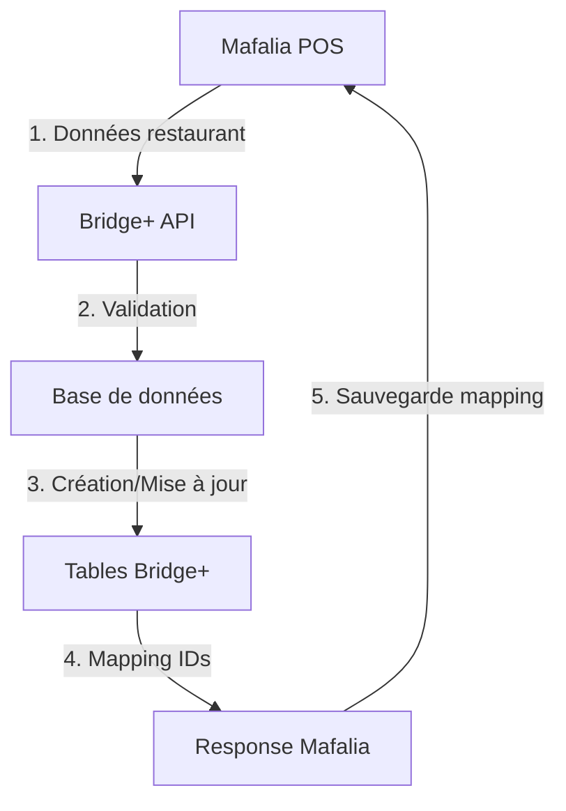

# 🔗 Intégration Bridge+ - Mafalia

## 📋 Vue d'ensemble

Cette intégration permet la synchronisation automatique des données entre **Mafalia** (système POS) et **Bridge+** (plateforme de livraison de repas).

## 🏗️ Architecture implémentée

### Base de données
- ✅ Tables modifiées avec champs `mafalia_*_id`
- ✅ Index optimisés pour les recherches
- ✅ Relations maintenues entre restaurants, catégories et produits

### APIs créées
- ✅ `POST /api/bridge/sync/restaurant` - Synchronisation complète
- ✅ `POST /api/bridge/sync/categories` - Synchronisation des catégories
- ✅ `POST /api/bridge/sync/products` - Synchronisation des produits
- ✅ `GET /api/bridge/sync/status/{restaurantId}` - Statut de synchronisation

### Sécurité
- ✅ Authentification par token Bearer
- ✅ Middleware d'authentification centralisé
- ✅ Configuration via variables d'environnement

## 🚀 Utilisation

### 1. Configuration

Créez un fichier `.env.local` avec :

```env
# Tokens API autorisés (séparés par des virgules)
BRIDGE_API_TOKENS=mafalia-api-token-2025,test-token-123

# Activer/désactiver l'authentification
BRIDGE_API_REQUIRE_AUTH=true

# URL de base de votre application
NEXT_PUBLIC_APP_URL=https://bridge-plus.com
```

### 2. Test de l'intégration

```bash
# Démarrer le serveur de développement
npm run dev

# Dans un autre terminal, tester l'API
node scripts/test-mafalia-integration.js
```

### 3. Utilisation côté Mafalia

```typescript
import { createMafaliaClient } from './lib/mafalia-client';

const client = createMafaliaClient(
  'https://bridge-plus.com',
  'mafalia-api-token-2025'
);

// Synchronisation complète
const result = await client.syncRestaurant(
  {
    id: 'restaurant_123',
    nom_restaurant: 'Mon Restaurant',
    statut: 'ouvert'
  },
  [
    {
      id: 'cat_1',
      nom_categorie: 'Fast Food'
    }
  ],
  [
    {
      id: 'prod_1',
      nom_produit: 'Burger Deluxe',
      prix: 5000,
      restaurant_id: 'restaurant_123',
      categorie_id: 'cat_1'
    }
  ]
);
```

## 📊 Flux de données



## 🔄 Logique de synchronisation

### Restaurants
- **Existant** : Mise à jour des informations
- **Nouveau** : Création avec `mafalia_restaurant_id`

### Catégories
- **Existant** : Mise à jour du nom
- **Nouveau** : Création avec `mafalia_category_id`

### Produits
- **Existant** : Mise à jour complète
- **Nouveau** : Création avec `mafalia_product_id`
- **Liaison** : Automatique avec restaurant et catégorie

## 🛡️ Sécurité

### Authentification
- Token Bearer requis pour toutes les requêtes
- Liste de tokens configurable
- Validation centralisée

### Validation des données
- Vérification des types
- Validation des relations (restaurant existe)
- Gestion des erreurs gracieuse

## 📈 Monitoring

### Logs
- Toutes les requêtes sont loggées
- Erreurs avec stack trace
- Métriques de performance

### Statut
- Endpoint de statut par restaurant
- Compteurs de catégories/produits
- Dernière synchronisation

## 🧪 Tests

### Tests automatisés
```bash
# Lancer les tests d'intégration
node scripts/test-mafalia-integration.js
```

### Tests manuels
```bash
# Test avec curl
curl -X POST http://localhost:3000/api/bridge/sync/restaurant \
  -H "Authorization: Bearer test-token-123" \
  -H "Content-Type: application/json" \
  -d '{"restaurant":{"id":"test","nom_restaurant":"Test"},"categories":[],"produits":[]}'
```

## 🔧 Maintenance

### Ajout de nouveaux tokens
1. Modifier `BRIDGE_API_TOKENS` dans `.env.local`
2. Redémarrer l'application

### Désactivation de l'auth (dev uniquement)
```env
BRIDGE_API_REQUIRE_AUTH=false
```

### Monitoring des erreurs
- Vérifier les logs de l'application
- Utiliser l'endpoint de statut pour diagnostiquer

## 📚 Documentation API

Voir `app/api/bridge/README.md` pour la documentation complète des endpoints.

## 🎯 Prochaines étapes

1. **Tests en production** avec de vraies données Mafalia
2. **Webhooks** pour synchronisation en temps réel
3. **Interface d'administration** pour gérer les synchronisations
4. **Monitoring avancé** avec métriques détaillées
5. **Synchronisation bidirectionnelle** (Bridge+ → Mafalia)

---

## 📞 Support

Pour toute question sur l'intégration :
- Consulter les logs de l'application
- Vérifier la configuration des tokens
- Tester avec l'endpoint de statut
- Utiliser les scripts de test fournis
